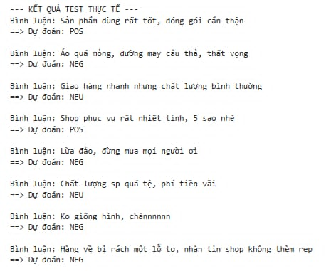

# 📊 Phân tích cảm xúc đa nhãn phản hồi khách hàng thương mại điện tử

## 🚀 Giới thiệu

Dự án tập trung vào việc **phân tích cảm xúc đa nhãn (multi-label sentiment analysis)** từ phản hồi khách hàng trong lĩnh vực thương mại điện tử.
Hệ thống có khả năng tự động phân loại cảm xúc dựa trên nội dung bình luận và số sao đánh giá, giúp doanh nghiệp hiểu rõ trải nghiệm người dùng.

---

## 🎯 Mục tiêu

* Tự động phân loại cảm xúc từ dữ liệu phản hồi khách hàng
* Giảm thiểu công việc xử lý thủ công
* Khai thác insight từ dữ liệu văn bản
* Xác định các vấn đề chính (pain points) ảnh hưởng đến trải nghiệm khách hàng

---

## 📂 Dữ liệu

* File **CSV thực tế** bao gồm:

  * Nội dung phản hồi khách hàng
  * Nhãn cảm xúc (đa nhãn)
  * Số sao đánh giá

---

## ⚙️ Công nghệ sử dụng

* Python
* Pandas (xử lý dữ liệu)
* Underthesea (xử lý ngôn ngữ tiếng Việt)
* Scikit-learn:

  * TF-IDF (vector hóa văn bản)
  * Logistic Regression (mô hình phân loại)

---

## 🔄 Quy trình thực hiện

### 1. Tiền xử lý dữ liệu

* Làm sạch văn bản (lowercase, loại bỏ ký tự đặc biệt)
* Tokenization tiếng Việt
* Loại bỏ stopwords

### 2. Biểu diễn dữ liệu

* Sử dụng **TF-IDF** để chuyển đổi văn bản thành vector

### 3. Huấn luyện mô hình

* Áp dụng **Logistic Regression** cho bài toán phân loại đa nhãn
* Đánh giá bằng các chỉ số: Accuracy, Precision, Recall, F1-score

### 4. Phân tích & trực quan hóa

* Phân bố cảm xúc
* WordCloud để tìm từ khóa nổi bật

---

## 📸 Kết quả

,

---

## 📊 Kết quả đạt được

* Xây dựng thành công mô hình phân loại với độ chính xác (**Accuracy**) đạt khoảng **7X%** *(cập nhật sau khi train model)*
* Tự động hóa việc phân loại **hàng nghìn bình luận**, giúp tiết kiệm khoảng **80% thời gian xử lý thủ công**
* Phát hiện các từ khóa tiêu cực (pain points) của khách hàng thông qua **WordCloud**

---

## 📁 Cấu trúc dự án

```bash
NPLsentiment/
│── data/
│ ├── NPLpro.csv
│ └── processed_NPLpro.csv
│
│── model/
│ └── model.pkl
│
│── notebook/
│ └── NPLsentiment.ipynb
│
│── src/
│ ├── preprocess.py
│ ├── train.py
│ └── predict.py
```

---

## ▶️ Cách chạy dự án

```bash
# Cài đặt thư viện
pip install -r requirements.txt

# Huấn luyện mô hình
python src/train.py

# Dự đoán
python src/predict.py
```

---

## 💡 Hướng phát triển

* Triển khai thành web app (Streamlit/Flask)
* Nâng cấp mô hình với Deep Learning (BERT, PhoBERT)
* Mở rộng dữ liệu để tăng độ chính xác
* Áp dụng real-time sentiment analysis


